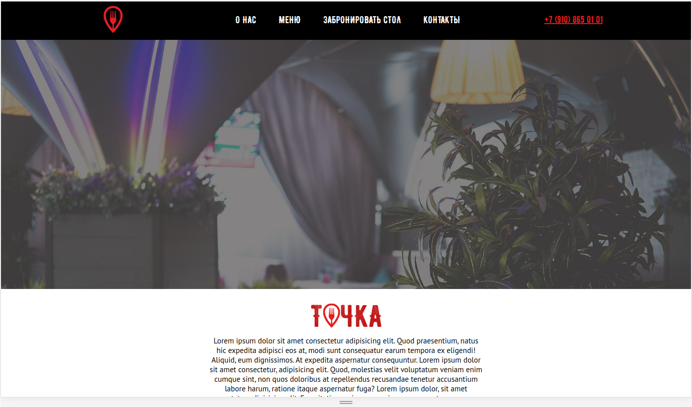
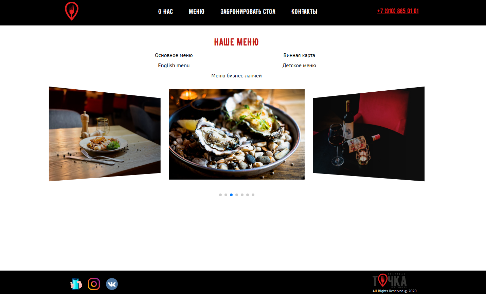
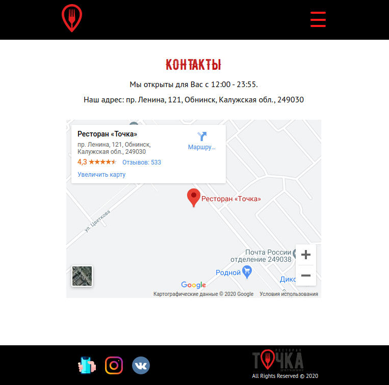
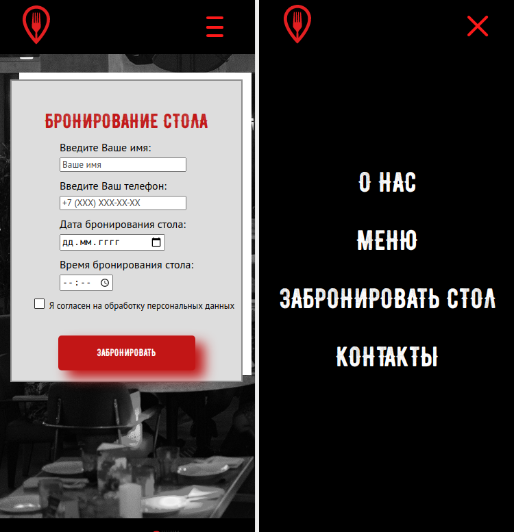

# Tochka_project

A site for a seafood restaurant "Tochka". 
Used the following stack: html, css, express, nodejs, handlebars.

Deployed on Heroku - https://tochkaproject.herokuapp.com/.

Desktop version:

Tablet version:

Mobile version:

